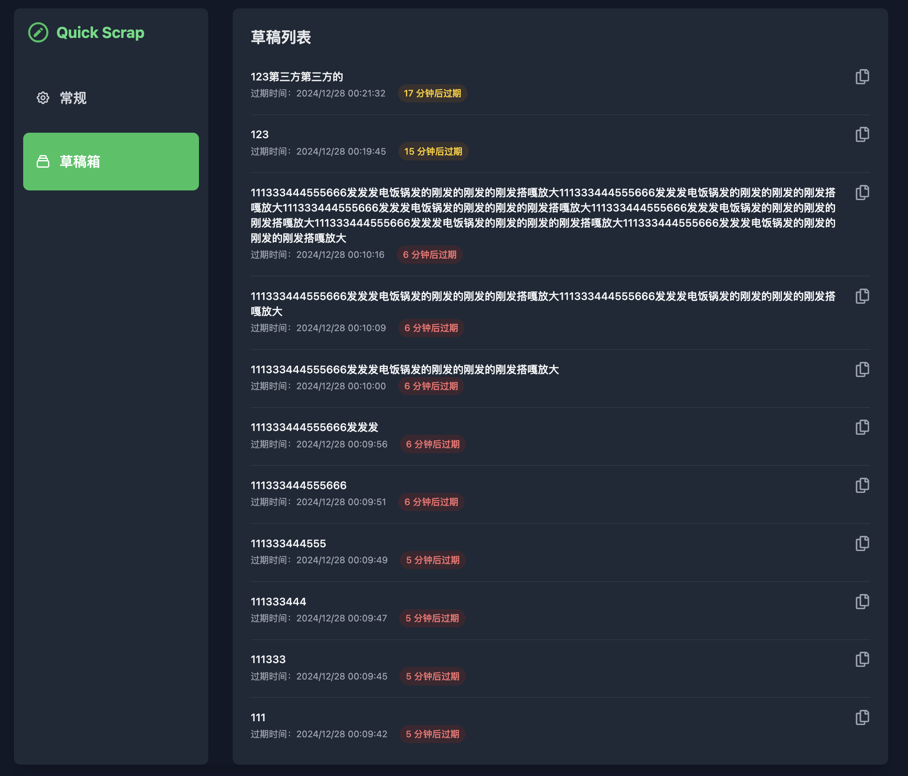

# QuickScrap 浏览器插件


QuickScrap 是一个简单而实用的浏览器扩展，用于快速保存临时文本内容。它允许用户创建具有自动过期时间的临时草稿，非常适合需要临时保存文本片段的场景。

## 主要功能

### 1. 快速草稿
- 一键保存文本内容为临时草稿
- 支持查看和更新最新的草稿
- 草稿自动过期功能，避免存储空间的无限增长

### 2. 自动过期
- 可自定义草稿的默认过期时间
- 支持多个过期时间选项：5分钟、15分钟、30分钟、1小时、24小时
- 系统自动清理过期的草稿

### 3. 个性化设置
- 支持深色模式
- 可自定义默认过期时间
- 可开关自动复制到剪贴板功能

## 使用方法

### 源码安装
1. 下载本项目代码目代码，并安装依赖
    ```bash
    git clone git@github.com:zhengweikeng/quick-scrap.git
    cd quickscrap
    npm install
    ```
2. 打开Chrome浏览器，进入扩展程序页面（chrome://extensions/），开启"开发者模式"
1. 点击"加载已解压的扩展程序"
2. 选择项目文件夹即可完成安装

## 开发环境

- Node.js
- TailwindCSS
- Chrome Extension API

## 许可证

[MIT License](LICENSE) 